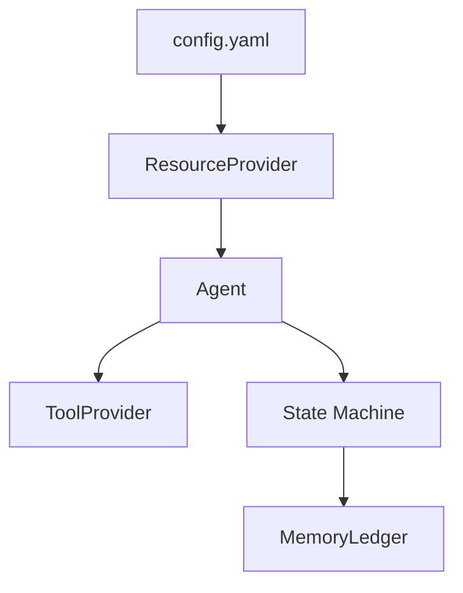

# Pipeline Agent

A flexible agent framework for building LLM-powered automation pipelines with tool calling, resource management, and state machine orchestration.

## Overview

Pipeline Agent is a Python framework that enables building sophisticated AI agents with:

- **Resource Injection** - Declarative dependency injection for LLMs, embeddings, and other resources
- **Tool System** - Expose Python methods as LLM-callable tools with automatic schema generation
- **State Machines** - FSM-based workflow orchestration with error recovery
- **Agent Abstractions** - Pre-built agents for code generation, testing, and review
- **Robust Tool Calling** - Alignment system for correcting misspelled tool names/arguments

## Architecture



## Modules

### Core Framework

- **[core/](core/README.md)** - Resource management, agent abstractions, FSM, and memory
- **[chat/](chat/README.md)** - Chat model implementations (Ollama) and tool alignment
- **[embeddings/](embeddings/README.md)** - Semantic and lexical text matching for tool alignment

### Agent Implementations

- **[agent/](agent/README.md)** - Pre-built agents (Simple, Reviewer, PythonCoder, etc.)

### Tools & Utilities

- **[coding/](coding/README.md)** - Python workspace management and script execution
- **[cmd_line/](cmd_line/README.md)** - Command execution and process monitoring
- **[directory/](directory/README.md)** - File system access with lazy loading

### Deprecated

- **jenkins_utils/** - Deprecated, scheduled for refactoring

## Quick Start

### Basic Agent

```python
from pipiline_agent.agent.simple import Simple
from pipiline_agent.core.resources import ResourceProvider

# Initialize resources from config
provider = ResourceProvider("config/config.yaml")
agent = provider.initialize_user("my_agent")

# Execute agent
result = agent.execute_agent("What is 2+2?")
print(result)
```

### Agent with Tools

```python
from pipiline_agent.agent.simple import PythonCoder

# Agent with Python workspace tools
coder = PythonCoder(
    workspace_path="./workspace",
    use_venv=True
)

# Agent can create and run scripts
result = coder.execute_agent(
    "Create a script that processes CSV files"
)
```

### Custom Agent

```python
from pipiline_agent.core.agents import BaseAgent, ResourceUser
from pipiline_agent.core.resources import resource, LLMFactory
from typing import Annotated

class MyAgent(ResourceUser, BaseAgent):
    model: Annotated[LLMFactory, resource(category="llm", rid="llm")]
    
    def __init__(self):
        super().__init__()
        self.add_sysprompt("You are a helpful assistant")
    
    def __execute__(self, task_context: str):
        # Custom implementation
        response = self.get_chat_model("model").invoke([...])
        return StateResult.NEXT, response.content
```

## Key Features

### Resource Injection

Define dependencies declaratively with automatic injection:

```python
class MyAgent(ResourceUser):
    model: Annotated[LLMFactory, resource(category="llm", rid="llm")]
    embeddings: Annotated[Any, resource(category="embeddings", rid="text-embedding")]
```

### Tool Calling

Expose methods as LLM-callable tools:

```python
class MyTools(ToolProvider):
    @toolmethod(name="search")
    def search(self, query: str) -> str:
        """Search for information"""
        return search_api(query)
```

### Tool Alignment

Automatically correct misspelled tool calls using lexical and semantic matching:

```python
# LLM calls "creat_script" instead of "create_script"
# ToolAligner automatically corrects it
aligner.align_tool_call(ToolCall(name="creat_script", args={...}))
# Returns: ToolCall(name="create_script", args={...})
```

### State Machine Workflows

Build complex workflows with FSM orchestration:

```python
fsm = FSM()
fsm.add_state("planning", PlanningAgent())
fsm.add_state("coding", CodingAgent())
fsm.add_state("testing", TestingAgent())

fsm.add_transition("planning", StateResult.NEXT, "coding")
fsm.add_transition("coding", StateResult.NEXT, "testing")

fsm.run(initial_state="planning")
```

## Configuration

Define resources in `config/config.yaml`:

```yaml
resources:
  llm:
    type: ollama
    host: http://localhost:11434
    model: llama2
  
  embeddings:
    type: fastembed
    model_name: BAAI/bge-small-en-v1.5

users:
  my_agent:
    type: agent.simple.Simple
    resources:
      llm: llm
```

## Requirements

- Python 3.10+
- Ollama (for LLM support)
- FastEmbed (for embeddings)

## Installation

```bash
pip install -r requirements.txt
```

## Documentation

Each module has comprehensive documentation:

- [Core Framework](core/README.md) - Architecture and abstractions
- [Agent Module](agent/README.md) - Pre-built agents
- [Chat Module](chat/README.md) - Chat models and tool alignment
- [Coding Module](coding/README.md) - Code generation tools
- [Command Line Module](cmd_line/README.md) - Process management
- [Directory Module](directory/README.md) - File system utilities
- [Embeddings Module](embeddings/README.md) - Text matching

## License

See LICENSE file for details.
