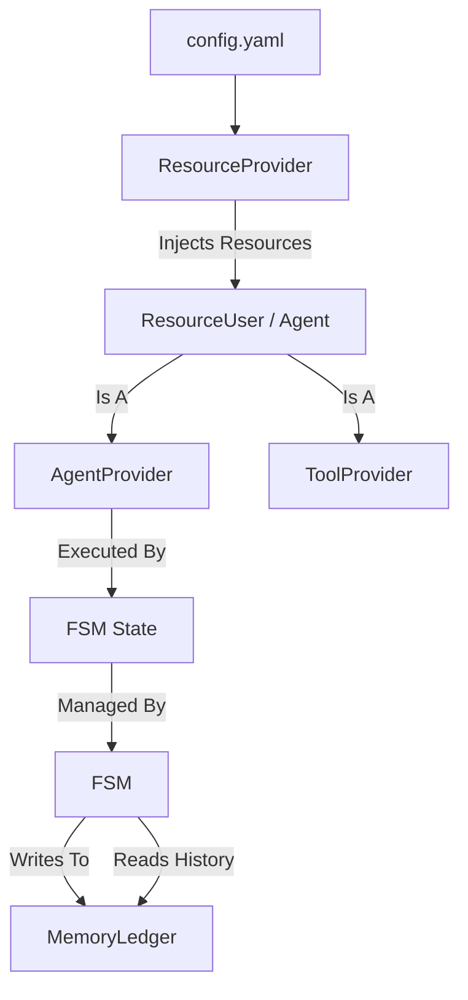

# Core Module Architecture

The `core` module corresponds to the foundational components of the Agent Framework. It provides the necessary abstractions for:
- Resource Management (LLMs, Embeddings, etc.)
- Agent & Tool Discovery
- Finite State Machine (FSM) Execution Logic
- Memory Management

## 1. Resource Management

The framework uses a dependency injection-style pattern to provide external resources (like LLMs and Embeddings) to agents.

### `ResourceProvider` (`ResourceProvider.py`)
the `ResourceProvider` is the central registry and factory for resources.
- **Config-Driven**: Reads user configuration (e.g., from `config.yaml` or a dict) to understand available resources.
- **Initialization**:
  - `initialize_users()`: Iterates through all users defined in `config.yaml` to instantiate and configure them.
  - `initialize_user(name)`: Instantiates a specific user by name.
- **Injection**: It inspects the `ResourceUser` (Agent) class for `Annotated` members requiring resources and injects them if `rid` (Resource ID) matches the config.

### `ResourceUser` (`ResourceUser.py`)
A base class for any component (Agent, Tool) that needs access to resources.
- **Declarative Dependencies**: Users declare resources using Python's `Annotated` syntax:
  ```python
  class MyAgent(ResourceUser):
      model: Annotated[Any, resource(category="llm", rid="main_llm")]
  ```
- **Reflection**: Provides methods to introspect declared resources for the `ResourceProvider`.

## 2. Agent & Tool Abstractions

### `BaseAgent` (`agents.py`)
Base class that combines `ResourceUser` and `ToolUser` to create an executable Agent within the FSM.
- **`@agentcall` Decorator**: Marks a specific method as the entry point for the agent's logic (in `AgentProvider` mixin).
  ```python
  @agentcall(name="planning-step")
  def plan(self, task_context, subscribed_mess, history_prompt): ...
  ```
- **Execution**: The `execute_agent` method dispatches calls to the decorated method, handling context formatting and error signaling.

### `ToolProvider` (`ToolProvider.py`)
A mixin for exposing methods as LangChain `StructuredTool` objects.
- **`@toolmethod` Decorator**: Marks methods to be exposed as tools.
  ```python
  @toolmethod(name="search_web")
  def search(self, query: str): ...
  ```
- **Discovery**: `get_tools()` reflects on the class to return a list of tools usable by LLMs.

## 3. Finite State Machine (`fsm.py`)

The `FSM` class drives the application flow.
- **State (`State`)**: Represents a step in the process. It holds an `AgentProvider` instance (the "worker" for that state).
- **Transitions (`Transition`)**: logic defining how to move from one state to another (STABLE -> STABLE, STABLE -> ERROR, etc.).
- **Execution Loop**:
  1. **Execute**: Calls `State.execute()`, which runs the agent's logic.
  2. **Result**: The agent returns `StateResult.NEXT` or `StateResult.ERROR`.
  3. **Transition**: The FSM moves to the target state based on the result.
  4. **Recovery**: If a state fails, the FSM enters an `ERROR` state and attempts to retry the last `STABLE` state.

## 4. Memory Management (`memory.py`)

### `MemoryLedger`
A simple, immutable append-only log of what happened.
- **Snapshots**: Stores `StateSnapshot` (state, output, timestamp).
- **Context Sharing**: Used to pass history between states so agents can see what happened previously.

## Component Interaction Diagram


